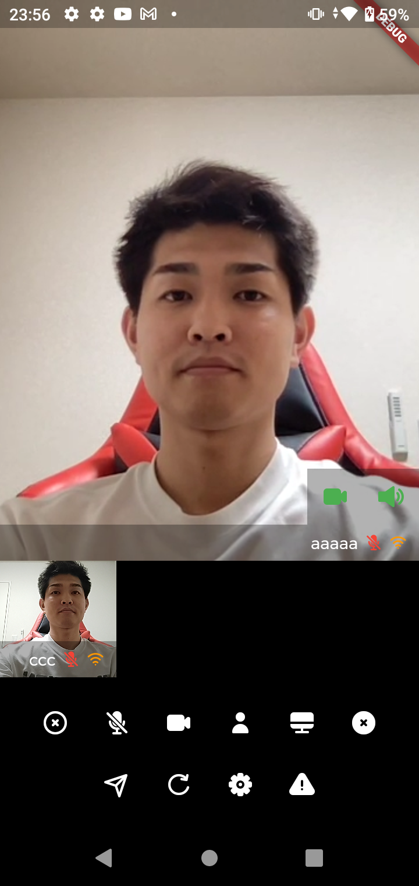
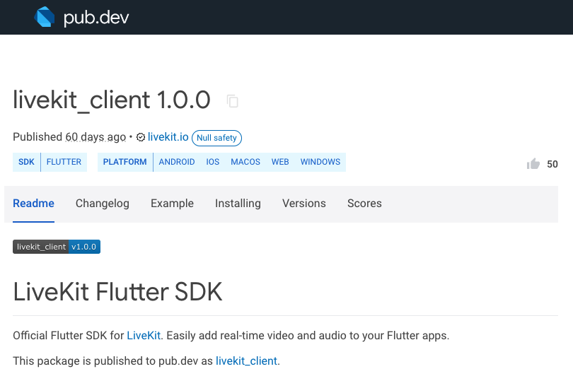

# Flutter ✕ Livekit でオンライン会議アプリを作る


---
# アジェンダ
  - 自己紹介
  - 開発環境
  - 今回作るもの
  - 手順解説


---
# 自己紹介
  - C#でWindowsアプリケーションを作っている田舎のサラリーマン

---
# 開発環境など
  - MacOS：12.2.1
  - Flutter：Version 3.0.1
  - Ubuntu Server 22.04 LTS

---
# 今回つくるもの




---
# ライブラリ紹介

https://pub.dev/packages/livekit_client



---
# 全体設計(シーケンス)


---
# 大まかな手順

- サーバの構築1(Livekitサーバ)
- サーバの構築2(Token処理サーバ)
- クライアントアプリの作成(Flutterアプリ)

## 重要：セキュリティ対策などはご自身で実施をお願いします。

---
# サーバの構築1(Livekitサーバ)の流れ

- dockerを使えるようにする
- LivekitのConfigファイルを生成する
- Livekitサーバを建てる

---
# サーバの構築1-1(Livekitサーバ)
  - 作業ディレクトリに移動しておく
    - `sudo mkdir /srv/livekit`
    - `cd /srv/livekit`
  - dockerを使えるようにする
    - `sudo apt-get update`
    - `sudo apt-get upgrade`
    - `sudo apt-get install docker`
  
---
# サーバの構築1-2(Livekitサーバ) 
- LivekitのConfigファイルを生成する(ディレクトリは`/srv/livekit`で実行)
    - `sudo docker run --rm -v$PWD:/output livekit/generate --local`
```bash
Unable to find image 'livekit/generate:latest' locally
--中略--
Generated livekit.yaml that's suitable for local testing

Start LiveKit with:
docker run --rm \
    -p 7880:7880 \
    -p 7881:7881 \
    -p 7882:7882/udp \
    -v $PWD/livekit.yaml:/livekit.yaml \
    livekit/livekit-server \
    --config /livekit.yaml \
    --node-ip=127.0.0.1

Note: --node-ip needs to be reachable by the client. 127.0.0.1 is accessible only to the current machine

Server URL:  ws://localhost:7880
API Key: XXX
API Secret: YYY

Here's a test token generated with your keys: ZZZ
```  
`API Key`と`API Secret`はメモしておくこと

---
# サーバの構築1-3(Livekitサーバ) 
  - Livekitサーバを建てる(ディレクトリは`/srv/livekit`で実行)
```bash
sudo docker run -d --rm -p 7880:7880 \
    -p 7881:7881 \
    -p 7882:7882/udp \
    -v $PWD/livekit.yaml:/livekit.yaml \
    livekit/livekit-server \
    --config /livekit.yaml \
    --node-ip <machine-ip>
```

※<machine-ip>はローカルで試す場合は`127.0.0.1`など。VPSで試す場合はグローバルIPアドレスを指定する。

---
# サーバの構築2(Token処理サーバ)の流れ

- nodejsの実行環境をインストール
- nodejsアプリの作成と、必要モジュールのインストール
- livekit-server-sdkを使い、Tokenを生成しクライアントに返却するサーバを作成
- nodejsアプリを実行

---
# サーバの構築2-1(Token処理サーバ)

* nodejsの実行環境をインストール

```bash
# node.jsとnpmをインストール
sudo apt-get install nodejs npm

# node.jsを最新にするためのnコマンドのインストール
sudo npm install n -g

 # nコマンドでnodejs, npmのLTS版をインストールする
sudo n lts

# バージョン確認
node -v
v16.15.1
```

---
# サーバの構築2-2(Token処理サーバ)

* nodejsアプリの作成と、必要モジュールのインストール

```bash
# Token処理サーバを作るディレクトリを作成
sudo mkdir /srv/token-server

# 移動して、nodeプロジェクトを作成
cd /srv/token-server
sudo npm init -y

#livekitSDK、express(webアプリ作成フレームワーク)、body-parserをインストール
sudo npm install livekit-server-sdk --save
sudo npm install express
sudo npm install body-parser

# app.jsを作っておく
sudo touch app.js
```

---
# サーバの構築2-3(Token処理サーバ)

* livekit-server-sdkを使い、Tokenを生成しクライアントに返却するサーバを作成

```javascript
// app.jsの中身

// Import Modules
const express = require('express');
const bodyParser = require('body-parser');
const livekitApi = require('livekit-server-sdk');
const AccessToken = livekitApi.AccessToken;

// Constants
const PORT = 3000;
const HOST = '0.0.0.0';
const API_KEY = "XXX";
const SECRET_KEY = "YYY";

// App
const app = express();
app.use(bodyParser.urlencoded({ extended: false }));
app.use(bodyParser.json());

app.post('/token', (req, res) => {
  const roomName = req.body.roomName;
  const participantName = req.body.userName;

  const at = new AccessToken(API_KEY, SECRET_KEY, {
    identity: participantName,
  });
  at.addGrant({ roomJoin: true, room: roomName });
  const token = at.toJwt();

  res.send(token);
});

app.listen(PORT, HOST);
```

---
# サーバの構築2-4(Token処理サーバ)

* nodejsアプリを実行

```bash
sudo node app.js
```
完了。

必要に応じてバックグラウンド実行や、サービス化をしておくと良い。


---
# クライアントの作成(Flutter)

公式Exampleをカスタマイズする

| 変更前                                                                 | 変更後                                                                 |
| ---------------------------------------------------------------------- | ---------------------------------------------------------------------- |
|  |  |

---
# クライアントの作成(Flutter)の流れ

* 公式リポジトリをfork：[fork後のリポジトリ](https://github.com/morio77/client-sdk-flutter-example-test)
* `Example`を改造していく：[改造後ソース](https://github.com/morio77/client-sdk-flutter-example-test/tree/main/example/lib)
  - Token取得クラス：[ソース](https://github.com/morio77/client-sdk-flutter-example-test/blob/d78c04976379e76392e1270a7b4799bef7826971/example/lib/token_server_gateway.dart#L8)
  - ユーザ名入力域：[ソース](https://github.com/morio77/client-sdk-flutter-example-test/blob/d78c04976379e76392e1270a7b4799bef7826971/example/lib/pages/connect.dart#L118)
  - ルーム選択ボタン：[ソース](https://github.com/morio77/client-sdk-flutter-example-test/blob/d78c04976379e76392e1270a7b4799bef7826971/example/lib/pages/connect.dart#L122)
  - 接続ボタン：[ソース](https://github.com/morio77/client-sdk-flutter-example-test/tree/d78c04976379e76392e1270a7b4799bef7826971/example/lib/pages#L159)
    - ルームに接続する(サンプルの`RoomPage`クラスをそのまま使う)

---
# クライアントの作成1(Flutter)

Token取得クラスを作成：[ソース](https://github.com/morio77/client-sdk-flutter-example-test/blob/d78c04976379e76392e1270a7b4799bef7826971/example/lib/token_server_gateway.dart#L8)

```dart
/// トークンサーバとの通信クラス
class TokenServerGateway {
  static Future<String> generateToken(
    String roomName,
    String userName,
  ) async {
    // パラメタ準備
    final url = Uri.http(Env.tokenServerUrl, '/token');
    final headers = {'content-type': 'application/json'};
    final body = json.encode({
      'roomName': roomName,
      'userName': userName,
    });

    // リクエスト
    final res = await http.post(url, headers: headers, body: body);
    if (res.statusCode == 200) {
      final token = res.body;
      return token;
    } else {
      print('Request failed with status: ${res.statusCode}.');
      return '';
    }
  }
}
```

---
# クライアントの作成2(Flutter)

接続画面にて、ユーザ名を入力できるようにする：[ソース](https://github.com/morio77/client-sdk-flutter-example-test/blob/d78c04976379e76392e1270a7b4799bef7826971/example/lib/pages/connect.dart#L118)

```dart

final _userNameCtrl = TextEditingController();

~~中略~~

// ユーザ名入力部分
Padding(
  padding: const EdgeInsets.only(bottom: 25),
  child: LKTextField(label: 'ユーザ名', ctrl: _userNameCtrl),
),
```

---
# クライアントの作成3(Flutter)

ルーム選択ボタンを作成する：[ソース](https://github.com/morio77/client-sdk-flutter-example-test/blob/d78c04976379e76392e1270a7b4799bef7826971/example/lib/pages/connect.dart#L122)

```dart
static const _roomNameList = ['room1', 'room2', 'room3'];
String _roomName = 'room1';

中略

// ルーム選択ボタン
DropdownButton<String>(
  value: _roomName,
  onChanged: (String? value) {
    setState(() {
      if (value != null) _roomName = value;
    });
  },
  items: _roomNameList
      .map<DropdownMenuItem<String>>((String roomName) {
    return DropdownMenuItem(
      value: roomName,
      child: Text(roomName),
    );
  }).toList(),
),
```

---
# クライアントの作成4a(Flutter)

ルームに接続するために。
前提として
* サンプルの`RoomPage`をそのまま使う。
* `RoomPage`には`Room`クラスを渡してあげる必要がある

```dart
class RoomPage extends StatefulWidget {
  //
  final Room room;

  const RoomPage(
    this.room, {
    Key? key,
  }) : super(key: key);
```

---
# クライアントの作成4b(Flutter)

接続ボタンを押したときに以下を実施する。

* トークンを生成する(前述の`TokenServerGateway`を使う)
* `LiveKitClient`(ライブラリ)を使って`Room`クラスのインスタンスを作る
* `RoomPage`に遷移する

---
# クライアントの作成4c(Flutter)

トークンを生成する(前述の`TokenServerGateway`を使う)：[ソース](https://github.com/morio77/client-sdk-flutter-example-test/tree/d78c04976379e76392e1270a7b4799bef7826971/example/lib/pages#L165)

```dart
final _userNameCtrl = TextEditingController();
String _roomName = 'room1';

中略

// トークン取得
final token = await TokenServerGateway.generateToken(
  _roomName,
  _userNameCtrl.text,
);
```

---
# クライアントの作成4d(Flutter)

`LiveKitClient`(ライブラリ)を使って`Room`クラスのインスタンスを作る：[ソース](https://github.com/morio77/client-sdk-flutter-example-test/tree/d78c04976379e76392e1270a7b4799bef7826971/example/lib/pages#L51)

```dart
final room = await LiveKitClient.connect(
  'http://${Env.livekitServerUrl}',
  token,
  roomOptions: RoomOptions(
    adaptiveStream: _adaptiveStream,
    dynacast: _dynacast,
    defaultVideoPublishOptions: VideoPublishOptions(
      simulcast: _simulcast,
    ),
  ),
);
```

---
# クライアントの作成4e(Flutter)

`RoomPage`に遷移する：[ソース](https://github.com/morio77/client-sdk-flutter-example-test/tree/d78c04976379e76392e1270a7b4799bef7826971/example/lib/pages#L63)

```dart
await Navigator.push<void>(
  context,
  MaterialPageRoute(builder: (_) => RoomPage(room)),
);
```

---
# クライアントの作成5(Flutter)

接続画面のカスタマイズ

解説は省略しますが、以下のようなことができます。

* 